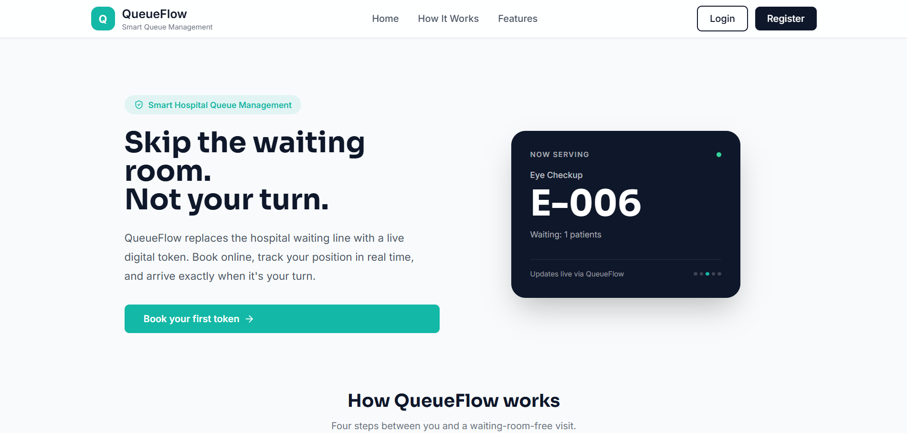
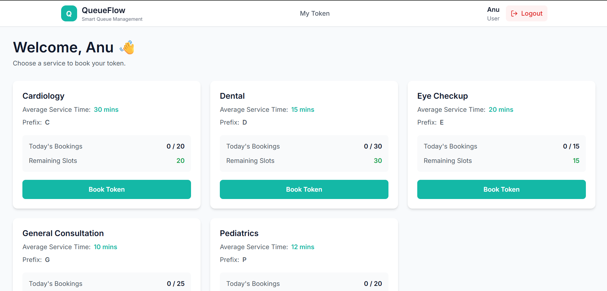
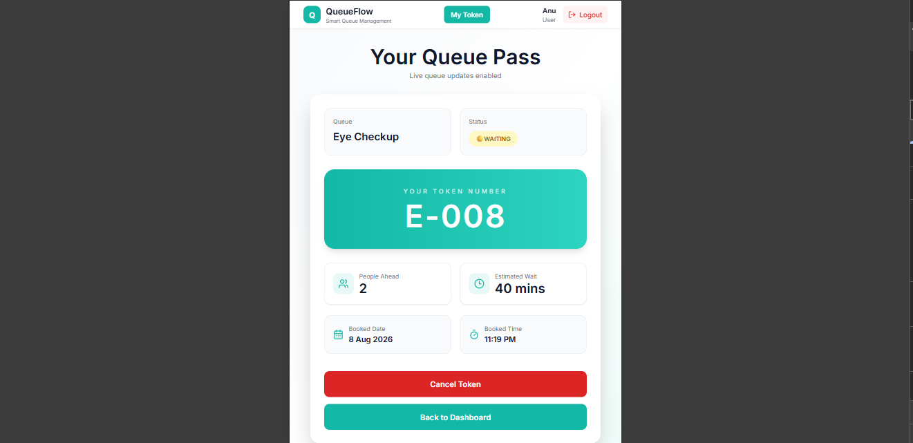
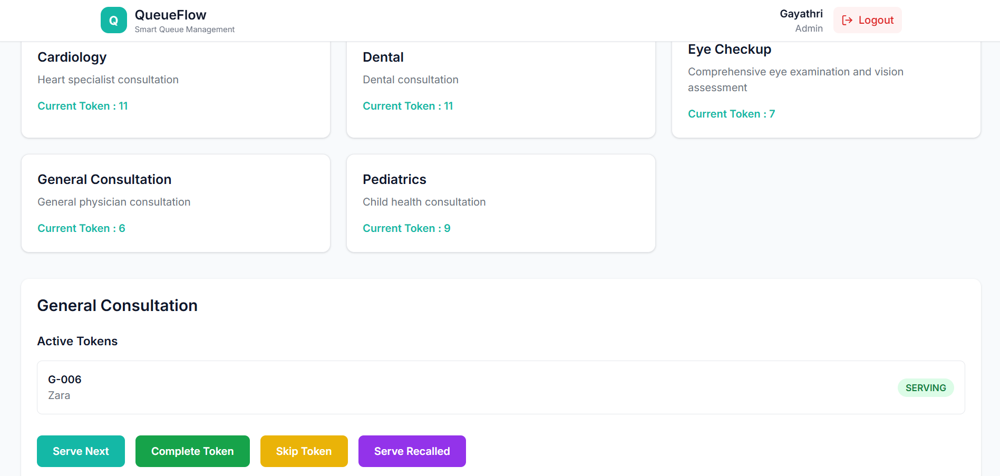

# 🏥 QueueFlow — Real-Time Hospital Queue Management System

QueueFlow is a full-stack MERN application that replaces physical hospital waiting lines with a real-time digital queue. Patients book a token, track their live queue position, and see who's currently being served — all without refreshing the page. Admins manage the entire queue lifecycle (serve, skip, recall, complete ,delete) across multiple hospital departments from a single dashboard.

**[Live Demo]·(https://queue-flow-hazel.vercel.app/)**
---

## 📌 Why I Built This

Hospital waiting rooms are a classic real-world coordination problem — multiple departments, shifting priorities, and patients who have no visibility into how long they'll wait. QueueFlow solves this by treating the queue as **shared, real-time state** rather than something patients have to physically stand in and staff have to manage on paper.

This project was built to go deep on a few core full-stack engineering problems:
- Keeping multiple clients in sync in real time (Socket.io)
- Designing clean, role-based REST APIs
- Handling concurrency correctly (what happens when 10 people book at once?)
- Building a UI that stays usable under live-updating data

---

## ✨ Features

### For Patients
- 🎫 Book a queue token for a specific department in seconds
- 📡 **Live queue tracking** — see your position update in real time, no refresh needed
- 🔔 **"Now Serving" status** — know exactly which token is currently being attended
- ⏱️ Estimated wait-time calculation based on live queue depth
- ❌ Self-service cancellation

### For Admins
- 🧑‍⚕️ Manage the full queue lifecycle: **serve → skip → recall → complete**
- 🏢 Oversee 5 hospital departments from one dashboard
- 🔐 Role-based access control (Admin vs. User) enforced via JWT
- 📊 Real-time visibility into queue length and status across departments

---

## 🛠️ Tech Stack

| Layer | Technology |
|---|---|
| Frontend | React, Tailwind CSS |
| Backend | Node.js, Express.js |
| Database | MongoDB |
| Real-time sync | Socket.io |
| Auth | JWT (JSON Web Tokens) |
| Deployment | Vercel + Render |

---

## 🏗️ Architecture Overview

```
┌─────────────┐        REST API (19 endpoints)      ┌─────────────┐
│   React     │ ───────────────────────────────────▶│   Express   │
│   Client    │◀─────────────────────────────────── │   Server    │
└──────┬──────┘                                      └──────┬──────┘
       │                                                     │
       │              Socket.io (bi-directional)             │
       └─────────────────────────────────────────────────────┘
                                                               │
                                                        ┌──────▼──────┐
                                                        │  MongoDB    │
                                                        └─────────────┘
```

**Why Socket.io alongside REST, not instead of it?**

REST handles standard CRUD (creating a token, fetching department lists). Socket.io handles the *state changes that other users need to know about immediately* — a token being served, skipped, or completed. Mixing both is the standard production pattern: REST for request/response, WebSockets for push updates.

---

## 🔌 API Endpoints

19 RESTful endpoints across authentication, queue, token, and dashboard management.

| Method | Endpoint | Access | Description |
| ------ | -------- | ------ | ----------- |
| POST | `/api/auth/register` | Public | Register a new user |
| POST | `/api/auth/login` | Public | Authenticate and receive JWT |
| POST | `/api/tokens/book` | User | Book a queue token |
| GET | `/api/tokens/my-token` | User | Get the user's active token |
| PATCH | `/api/tokens/cancel` | User | Cancel the user's token |
| PATCH | `/api/tokens/cancel-admin` | Admin | Cancel a user's token |
| GET | `/api/queues/live` | Public | Get currently active queues |

---

## 🔐 Security Considerations

- Passwords hashed with **bcrypt** before storage
- JWT stored and verified on protected routes via middleware
- Role-based route guards — Admin-only endpoints reject User tokens at the middleware layer, not just hidden in the UI
- Input validation on all write endpoints to prevent malformed queue state

---

## 🚀 Getting Started

### Prerequisites
- Node.js (v18+)
- MongoDB (local or Atlas)

### Installation

```bash
# Clone the repo
git clone https://github.com/your-username/queueflow.git
cd queueflow

# Install server dependencies
cd server
npm install

# Install client dependencies
cd ../client
npm install
```

### Environment Variables

Create a `.env` file in `/server`:

```env
MONGO_URI=your_mongodb_connection_string
JWT_SECRET=your_jwt_secret
PORT=5000
```

### Run Locally

```bash
# Terminal 1 — start backend
cd server
npm run dev

# Terminal 2 — start frontend
cd client
npm run dev
```

App will run on `http://localhost:5173` (client) and `http://localhost:5000` (server).

---

## 📁 Project Structure

```
queueflow/
├── client/                # React frontend
│   ├── src/
│   │   ├── components/
│   │   ├── pages/
│   │   ├── context/
│   │   └── assets/
│
├── server/                # Express backend
│   ├── controllers/
│   ├── models/
│   ├── routes/
│   ├── middleware/
│   ├── config/
│   └── socket/
│
└── README.md
```

---

## 🧪 Testing Notes

Real-time sync was validated with **10+ concurrent tokens across live cross-tab sessions** to confirm queue state stays consistent when multiple patients book, and multiple admin actions (serve/skip/recall) fire in quick succession.

---

## 🗺️ Roadmap

- [ ] SMS/email notifications when a patient's token is approaching "Now Serving"
- [ ] Analytics dashboard for department-wise average wait times
- [ ] Multi-hospital and multi-branch support

---

## 📸 Screenshots

### Landing Page



### Patient Dashboard



### Live Token Tracking



### Admin Dashboard



---

## 📄 License

This project is developed for educational and portfolio purposes.

---

## 👩‍💻 Author

**Gayathri**
